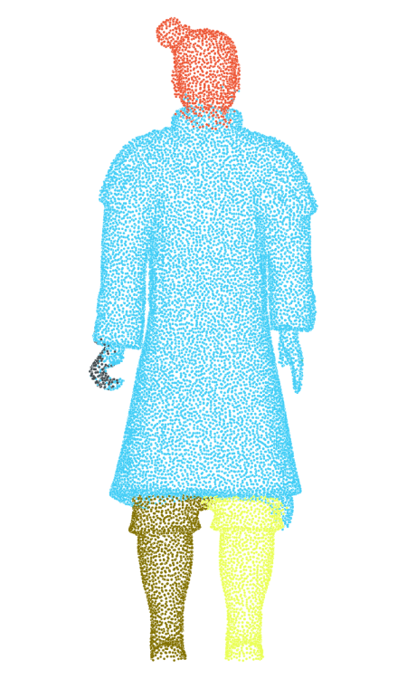
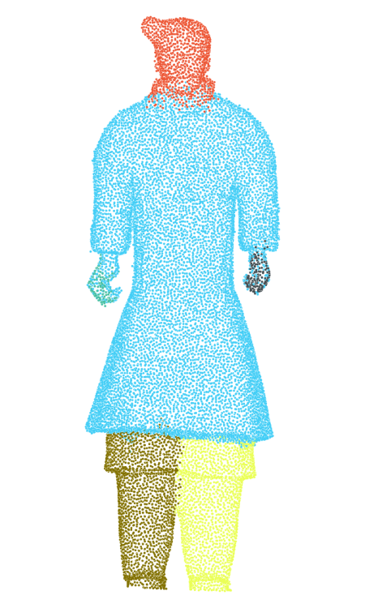
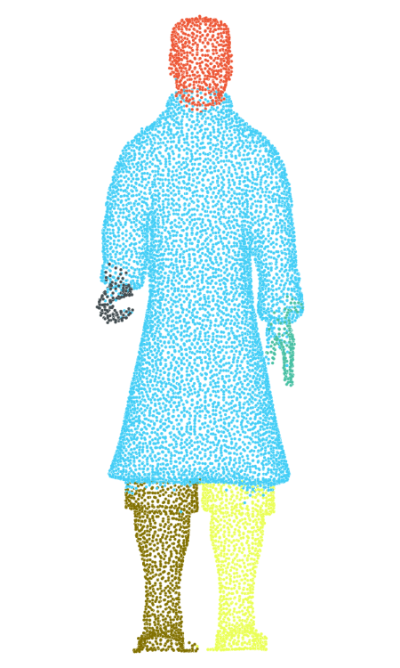
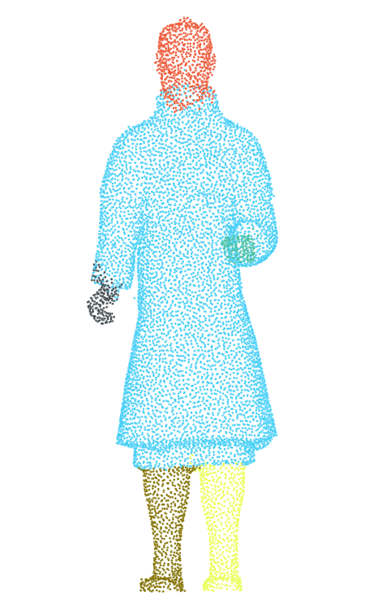

## SRG-Net Source Code

### Install dependency
`pip install -r requirements.txt`

### SRG-Net
`python srg_dgcnn_refine.py`

### SRG-DGCNN
`python srg_dgcnn.py`

### SRG-PointNet2
`python srg_pointnet2.py`

### SRG-PointNet
`python srg_pointnet.py`

### Kmeans-DGCNN
`python kmeans_dgcnn.py`

### Kmeans-PointNet2
`python kmeans_pointnet2.py`

### Kmeans-PointNet
`python kmeans_pointnet.py`

### Results on Terracotta Warriors

     
     
     
    

### Results on ShapeNet

Method | Airplane | bag | earphone | knife | laptop | motorbike | mug 
 ----  |  ----    |  ---- |  ----  | --- | --- | --- | ---   
SRG-Net | 73.0493 | 67.0935 | 62.4256 | 83.243 | 82.6076 | 76.7677 | 65.8810
SRG-DGCNN | 67.7393 | 61.2568 | 56.06 | 77.0035 | 75.8854 | 70.7194 | 59.3024 
SRG-Pointnet2 | 61.1865 | 54.4515 | 51.6673 | 71.9515 | 69.9074 | 64.3308 | 53.8897 
SRG-Pointnet | 57.1590 | 51.0517 | 47.2101 | 67.9229 | 66.4234 | 61.2438 | 49.1265 